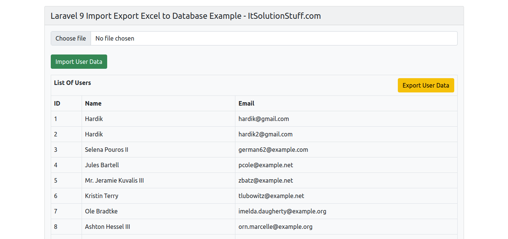

install maatwebsite/excel package via the Composer package manager, so one your terminal and fire bellow command:
```
composer require psr/simple-cache:^1.0 maatwebsite/excel
```
we will create some dummy records for users table, so we can export them with that users. so let's run bellow tinker command:
```
php artisan tinker

User::factory()->count(10)->create()
```
In maatwebsite 3 version provide way to built import class and we have to use in controller. So it would be great way to create new Import class. 
So you have to run following command and change following code on that file:
```
php artisan make:import UsersImport --model=User
```
example : 
```
<?php
  
namespace App\Imports;
  
use App\Models\User;
use Maatwebsite\Excel\Concerns\ToModel;
use Maatwebsite\Excel\Concerns\WithHeadingRow;
use Hash;
  
class UsersImport implements ToModel, WithHeadingRow
{
    /**
    * @param array $row
    *
    * @return \Illuminate\Database\Eloquent\Model|null
    */
    public function model(array $row)
    {
        return new User([
            'name'     => $row['name'],
            'email'    => $row['email'], 
            'password' => Hash::make($row['password']),
        ]);
    }
}
```
maatwebsite 3 version provide way to built export class and we have to use in controller. So it would be great way to create new Export class. 
So you have to run following command and change following code on that file:
```
php artisan make:export UsersExport --model=User
```
example :
```
<?php
  
namespace App\Exports;
  
use App\Models\User;
use Maatwebsite\Excel\Concerns\FromCollection;
use Maatwebsite\Excel\Concerns\WithHeadings;
  
class UsersExport implements FromCollection, WithHeadings
{
    /**
    * @return \Illuminate\Support\Collection
    */
    public function collection()
    {
        return User::select("id", "name", "email")->get();
    }
  
    /**
     * Write code on Method
     *
     * @return response()
     */
    public function headings(): array
    {
        return ["ID", "Name", "Email"];
    }
}
```
In this step, we will create UserController with index(), export() and import() method. so first let's create controller by following command 
and update code on it.
```
php artisan make:controller UserController
```
example app/Http/Controllers/UserController.php
```
<?php
  
namespace App\Http\Controllers;
  
use Illuminate\Http\Request;
use App\Exports\UsersExport;
use App\Imports\UsersImport;
use Maatwebsite\Excel\Facades\Excel;
use App\Models\User;
  
class UserController extends Controller
{
    /**
    * @return \Illuminate\Support\Collection
    */
    public function index()
    {
        $users = User::get();
  
        return view('users', compact('users'));
    }
        
    /**
    * @return \Illuminate\Support\Collection
    */
    public function export() 
    {
        return Excel::download(new UsersExport, 'users.xlsx');
    }
       
    /**
    * @return \Illuminate\Support\Collection
    */
    public function import() 
    {
        Excel::import(new UsersImport,request()->file('file'));
               
        return back();
    }
}
```
In this step, we need to create routes for list of users, import users and export users. so open your "routes/web.php" file and add following route.

example routes/web.php
```
<?php
  
use Illuminate\Support\Facades\Route;
  
use App\Http\Controllers\UserController;
  
/*
|--------------------------------------------------------------------------
| Web Routes
|--------------------------------------------------------------------------
|
| Here is where you can register web routes for your application. These
| routes are loaded by the RouteServiceProvider within a group which
| contains the "web" middleware group. Now create something great!
|
*/
 
Route::controller(UserController::class)->group(function(){
    Route::get('users', 'index');
    Route::get('users-export', 'export')->name('users.export');
    Route::post('users-import', 'import')->name('users.import');
});
```
In Last step, let's create users.blade.php(resources/views/users.blade.php) for layout and we will write design code here and put following code:

example resources/views/users.blade.php
```
<!DOCTYPE html>
<html>
<head>
    <title>Laravel 9 Import Export Excel to Database Example - ItSolutionStuff.com</title>
    <link href="https://cdn.jsdelivr.net/npm/bootstrap@5.0.2/dist/css/bootstrap.min.css" rel="stylesheet">
</head>
<body>
     
<div class="container">
    <div class="card bg-light mt-3">
        <div class="card-header">
            Laravel 9 Import Export Excel to Database Example - ItSolutionStuff.com
        </div>
        <div class="card-body">
            <form action="{{ route('users.import') }}" method="POST" enctype="multipart/form-data">
                @csrf
                <input type="file" name="file" class="form-control">
                <br>
                <button class="btn btn-success">Import User Data</button>
            </form>
  
            <table class="table table-bordered mt-3">
                <tr>
                    <th colspan="3">
                        List Of Users
                        <a class="btn btn-warning float-end" href="{{ route('users.export') }}">Export User Data</a>
                    </th>
                </tr>
                <tr>
                    <th>ID</th>
                    <th>Name</th>
                    <th>Email</th>
                </tr>
                @foreach($users as $user)
                <tr>
                    <td>{{ $user->id }}</td>
                    <td>{{ $user->name }}</td>
                    <td>{{ $user->email }}</td>
                </tr>
                @endforeach
            </table>
  
        </div>
    </div>
</div>
     
</body>
</html>
```
All the required steps have been done, now you have to type the given below command and hit enter to run the Laravel app:
```
php artisan serve
```
Now, Go to your web browser, type the given URL and view the app output:
```
http://localhost:8000/users
```
output:



### references :
- https://www.itsolutionstuff.com/post/laravel-9-import-export-excel-and-csv-file-tutorialexample.html
